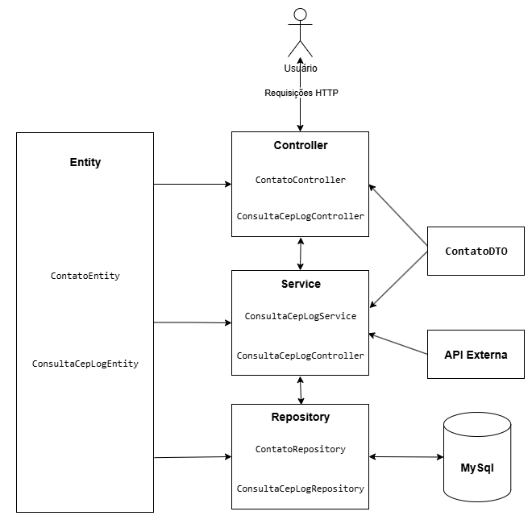

# Agenda de Endereços

Aplicação desenvolvida em **Java 17 com Spring Boot** para cadastro de contatos e integração com serviço externo de consulta de **CEP**.  
O projeto foi construído com base em princípios **SOLID**, usando arquitetura em camadas e persistindo logs de consultas de CEP em banco de dados.

---

## Desafio técnico

O tema do desafio é livre, use a criatividade e desenvolva uma aplicação que atenda os critérios abaixo:

1. Faça um desenho de solução para explicação da sua aplicação; ✅
2. Sua aplicação deverá prover a capacidade de realizar as operações de busca de cep em uma api externa (de preferência para fazer a api mocada com Wiremock, Mockoon ou similar); ✅
3. Os logs das consultas precisam ser gravados em base de dados, com o horário da consulta e os dados que retornaram da api. ✅
4. Sua aplicação deverá utilizar os conceitos básicos de SOLID; ✅
5. Seu repositório deverá ser exposto publicamente no Git. ✅

### Tecnologias obrigatórias:

- Java versão 11 ou superior. ✅

- Banco de dados relacional ou não relacional ✅

---

## Funcionalidades

- Cadastrar contato informando nome, e-mail, telefone, CEP, número e complemento.
- Consultar automaticamente endereço completo a partir do CEP (API Mockada).
- Persistir os contatos em banco de dados relacional (MySQL).
- Armazenar log de cada consulta de CEP com data, hora e json de retorno.
- Endpoints REST.
- Tratamento de erros padronizado.

---

## Arquitetura

- **Controller**: recebe requisições HTTP e retorna respostas JSON.
- **DTO**: garante validação dos dados de entrada (nome, email, telefone, cep).
- **Service**: regra de negócio, integra com o cliente de CEP e persiste dados.
- **Repository**: abstração de persistência via Spring Data JPA.
- **Database**: armazenamento em MySQL (contatos + logs).

### Diagrama da Solução

---

## Tecnologias Utilizadas

- **Java 17**
- **Spring Boot** (Web, Data JPA, Validation)
- **MySQL**
- **RestTemplate** (integração com API de CEP)
- **Maven**
- **Lombok**
- **Mockoon**

## Endpoints

### Contatos

- POST /contatos - Cadastrar contato
- GET /contatos - Listar todos os contatos
- GET /contatos/{id} - Buscar contato por ID

### Logs

- GET /logs - Listar logs de consultas de CEP